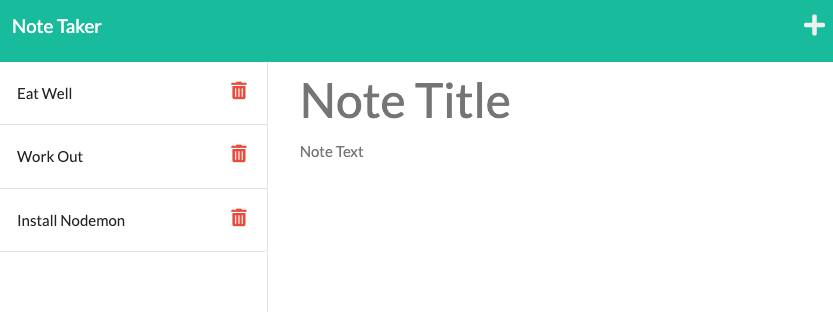
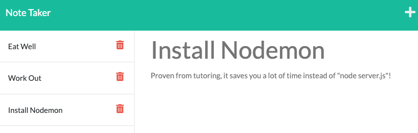
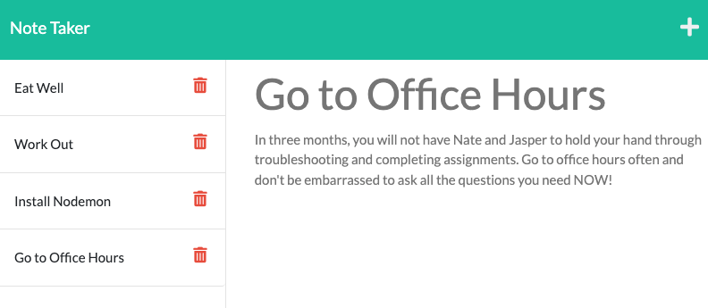

# ExpressJS-Heroku-Note-Taker

## Work References
* All activities inside RUT-VIRT-FSF-PT-06-2022-U-LOLC/11-Express 😔
* My awesome Study Buddies/Tutors/TA/Instructor 😊

## User Story

```
AS A coding bootcamp student
I WANT to create a simple note taker to remind myself of daily tasks/errands
SO THAT I can reduce stress and reward myself for tackling daily tasks/errands
```

## Acceptance Criteria

```
GIVEN an ExpressJS-Heroku-Note-Taker
WHEN I open the note taker
THEN I am presented with a simple landing page with a link to all notes
WHEN I enter my notes page
THEN I see my old notes on the left, empty fields to new note's title and content to the right
WHEN I create new note's title and content
THEN I can save all new content by clicking on the "save" icon
WHEN I save all items
THEN the new note is listed below my old notes to the left
WHEN I click on any note on the left
THEN the title and content of clicked note appears to the right
WHEN I click on the "write" icon next to my save icon
THEN I can create a brand new note
```

## Screenshot




## Deployed URLs
* <a href = https://github.com/leanonruthie/ExpressJS-Heroku-Note-Taker.git>https://github.com/leanonruthie/ExpressJS-Heroku-Note-Taker.git/</a>
* <a href = "https://boiling-harbor-24556.herokuapp.com/">https://boiling-harbor-24556.herokuapp.com/</a>

